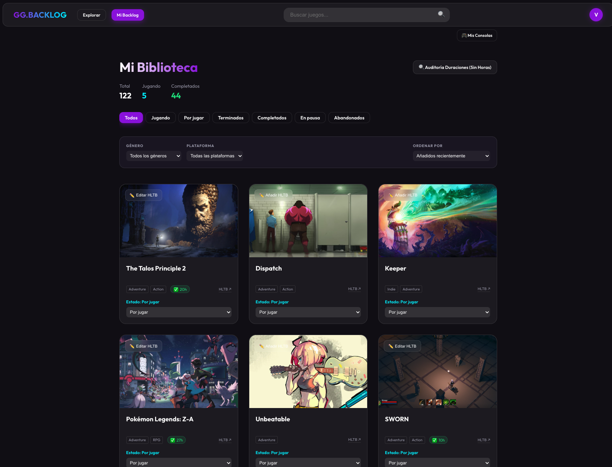

# 🎮 Game Backlog Manager

> [!NOTE]
> This project was developed with **Antigravity**, a powerful agentic AI coding assistant by Google DeepMind, as part of a learning journey in advanced agentic coding.

## 📸 Screenshots


*Discovering the latest and greatest games.*


*Managing the personal collection with filtered views.*

## ✨ Key Features

### 📚 Intelligent Library Management
- **Personal Backlog**: Organize your collection by status: *Playing, Beaten, Completed, Shelved,* or *Abandoned*.
- **Smart Filtering**: Instantly filter your library by **Genre** (RPG, Action, Indie...) or **Platform** (PC, PS5, Switch...).
- **Console Exclusives**: Configure your owned platforms to see only relevant games.

### ⏱️ HowLongToBeat Integration
- **Playtime Tracking**: Automatically fetches "Main Story" duration data for every game.
- **Time Sorting**: Sort your backlog by shortest/longest playtime to decide what to play next based on your free time.
- **Manual Override**: "Verified" mode allows you to correct HLTB data with your own completion times.

### 🔍 Discovery & Search
- **Trending & Upcoming**: Explore what's hot right now and what's coming in 2025.
- **Curated Lists**: Access "Best of All Time" lists by genre (RPGs, Action, Strategy...).
- **Instant Search**: Find any game in the massive RAWG database with a debounced, high-performance search bar.

### 🎨 Premium User Experience
- **Glassmorphism Design**: A modern, dark-themed UI with translucent cards and blurry backdrops.
- **Responsive**: Fully optimized for Desktop, Tablet, and Mobile.
- **Local Privacy**: All data is stored in your browser's `LocalStorage`. No external database required.

## 🚀 Getting Started

1. **Clone the repository**:
   ```bash
   git clone [your-repo-url]
   ```

2. **Install dependencies**:
   ```bash
   npm install
   ```

3. **Set up environment variables**:
   Create a `.env` file in the root directory and add your RAWG API Key:
   ```env
   VITE_RAWG_API_KEY=your_api_key_here
   ```

4. **Run the development server**:
   ```bash
   npm run dev
   ```

## 🛠️ Built With

- [React](https://reactjs.org/)
- [TypeScript](https://www.typescriptlang.org/)
- [Vite](https://vitejs.dev/)
- [RAWG API](https://rawg.io/apidocs)
- Vanilla CSS (Glassmorphism design)

## 📄 License

MIT
